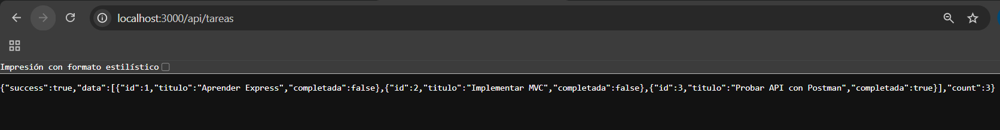
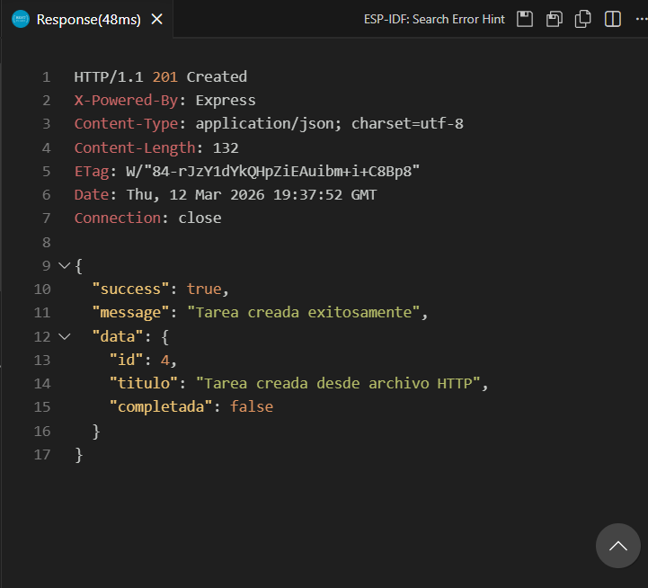
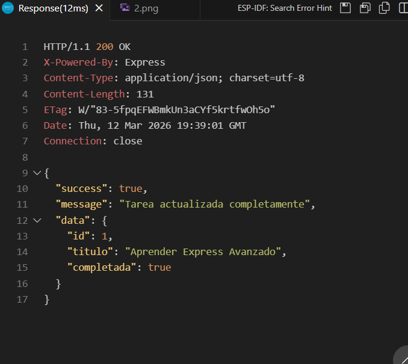
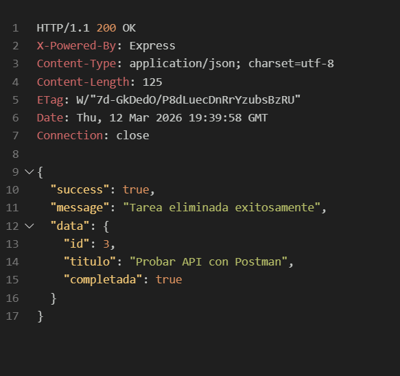
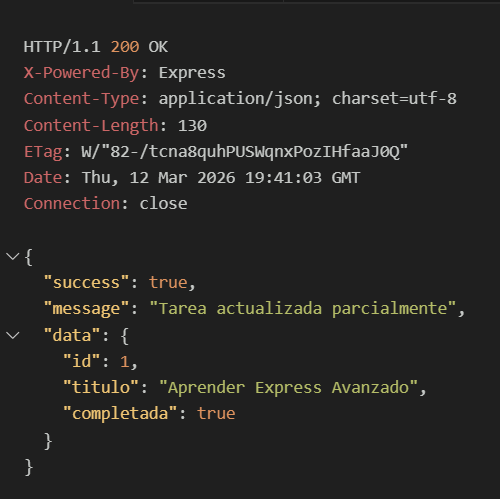
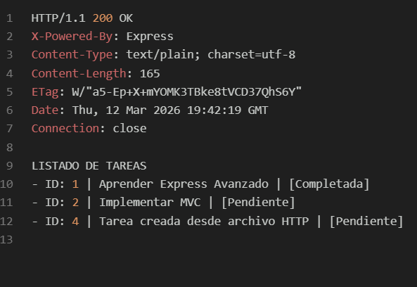

# API DE GESTIÓN DE TAREAS (MVC)

Este proyecto es una API REST desarrollada con Node.js y Express siguiendo el patrón de arquitectura MVC. Permite gestionar tareas mediante persistencia en memoria.

---

##  INSTALACIÓN Y EJECUCIÓN

1. **Instalar dependencias:**
   npm install

2. **Ejecutar en modo desarrollo:**
   npm run dev

> El servidor corre en: http://localhost:3000

---

##  ENDPOINTS DISPONIBLES

| MÉTODO | ENDPOINT | DESCRIPCIÓN |
| :--- | :--- | :--- |
| GET | /api/tareas | Listar todas (soporta ?formato=text) |
| GET | /api/tareas/:id | Obtener una tarea por ID |
| GET | /api/tareas/buscar | Buscador (?q=termino) |
| POST | /api/tareas | Crear nueva tarea |
| PUT | /api/tareas/:id | Actualización total (Body JSON) |
| PATCH | /api/tareas/:id | Actualización parcial (Body JSON) |
| DELETE | /api/tareas/:id | Eliminar una tarea |

---

##  ESTRUCTURA DEL PROYECTO

- **Models:** Lógica de datos y arreglo en memoria.
- **Controllers:** Gestión de peticiones y respuestas HTTP.
- **Routes:** Definición de los puntos de acceso.
- **App/Server:** Configuración y encendido del servidor.

---

##  PRUEBAS EN THUNDER

### Prueba de GET (Obtener todas)

